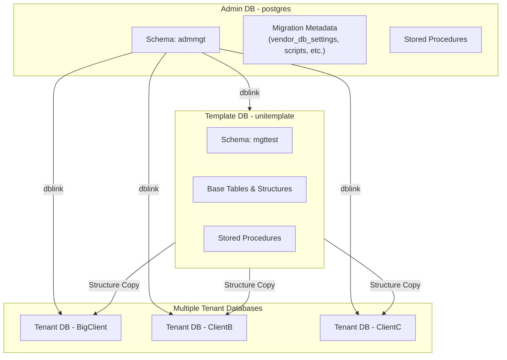

# Multi-Tenant Architecture: A Database or Schema Per Tenant?  
_A DB-Native Approach to Migration Management_

## Overview
When designing a **multi-tenant architecture**, the right strategy depends on factors like **tenant isolation**, **scalability**, **operational complexity**, **security**, and **cost**.  
Here’s a simplified trade-off spectrum:

- **Highest isolation & control** → One database per tenant  
- **Balance of isolation & manageability** → One schema per tenant  
- **Simplicity & scalability** → Shared schema with partitioned tables  

If you choose **a separate database or schema per tenant**, you must manage the operational overhead of maintaining and migrating objects across many databases.

While tools like **Flyway** and **Liquibase** work well, this proof of concept uses a **database-native approach** for more granular control — particularly for:
- Table creation (including **partitioning** support)
- Managing objects like **stored procedures**

The implementation runs entirely **inside PostgreSQL** using the `dblink` extension, with authentication currently handled in stored procedures (to be reworked for production).

---

## Scripts Overview

### **Script 1:  1_admin_setup.sql  – Initialize Admin Schema**
Run this script while connected to the **default PostgreSQL database** (commonly `postgres`).

- Creates a schema called **`admmgt`**, the control plane for tenant DB management.
- Creates all required objects (**tables**, **stored procedures**, etc.) within `admmgt`.

---

### **Script 2a: demo_separate_db.sql – Demonstration**
Simulates a basic use case of the framework when using separate DBs for each tenant.

1. **Create a template database**
   - Creates a DB called `unitemplate`  
   - Adds the `mgttest` schema. 
     - This is a sample schema and can be replaced with the schema(s) needed for your app.
     - If you change the schema name, make sure that is reflected when inserting data to create objects (tables..).
2. **Register databases**
   - Inserts a record into `admmgt.vendor_db_settings` for `unitemplate` (status: created)  
   - Inserts a record for `BigClient` (status: pending creation)  
3. **Create a migration script**
   - Inserts a record into `admmgt.scripts` with `ID = 1`  
   - Populates:
     - `admmgt.script_tables` – Table list  
     - `admmgt.script_table_columns` – Column definitions  
     - `admmgt.script_table_partitions` – Partitioning instructions  
   - Example: Adds **two related tables** with a **foreign key relationship**
4. **Apply migration updates**
   - Updates script records to mark them as ready  
   - Demonstrates:
     - Adding a **new column**  
     - Applying **stored procedures**  
     - Executing a **stored procedure** in migration context  

---

### **Script 2b: demo_separate_schema.sql – Demonstration**
Simulates a basic use case of the framework when using separate schemas for each tenant.

1. **Register schemas**
   - Inserts a record into `admmgt.vendor_db_settings` for `unitemplate` (status: pending creation)  
   - Inserts a record for `BigClient` (status: pending creation)  
2. **Create a migration script**
   - Inserts a record into `admmgt.scripts` with `ID = 1`  
   - Populates:
     - `admmgt.script_tables` – Table list  
     - `admmgt.script_table_columns` – Column definitions  
     - `admmgt.script_table_partitions` – Partitioning instructions  
   - Example: Adds **two related tables** with a **foreign key relationship**
3. **Apply migration updates**
   - Updates script records to mark them as ready  
   - Demonstrates:
     - Adding a **new column**  
     - Applying **stored procedures**  
     - Executing a **stored procedure** in migration context  

---

## Key Notes
- **`vendor_db_settings.updateflag`** → Controls which DBs receive updates.  
- **`vendor_db_settings.scriptversion`** → Tracks current migration script applied to each DB.

---

## Procedure Calls

Once setup is complete, use these stored procedures to manage tenant databases:

```sql
-- Create tenant databases marked for creation using the template
CALL admmgt.create_database();

-- Apply pending scripts to relevant databases (starting with template)
CALL admmgt.applyScripts(t_separatedb); --pass 1 or 0 (Separate DB 1 or Schema 0)

-- Maintain range partitions, looking ahead N days
CALL admmgt.applyMaintenance(t_separatedb, t_numdays => 30);

-- Copy procedures from template DB's mgttest schema to all tenants Called before and after migration scripts by applyScripts.
CALL admmgt.refesh_stored_procedures(t_separatedb, t_scriptid);
```

---

## Architecture Diagram (Database per Tenant)



## Migration Flow Diagram (Database per Tenant)

```mermaid
flowchart LR
  A["Define Script in Admin DB<br/>(admmgt.scripts, script_tables,<br/>script_table_columns, script_table_partitions)"] 
    --> B["Mark Script Ready<br/>(e.g., status/flags updated)"]

  B --> C["Run: CALL admmgt.applyScripts()"]
  C --> D["Apply to Template DB<br/>(unitemplate via dblink)"]

  D --> E{Template Apply<br/>Successful?}

  E -- "Yes" --> F["Propagate to Tenant DBs<br/>(iterate vendor_db_settings with updateflag=true)"]
  F --> G["Update scriptversion<br/>per database"]
  G --> H["Log results / exceptions"]

  E -- "No" --> H

  H --> I["Optional: CALL admmgt.applyMaintenance(30)<br/>(range partition upkeep)"]
